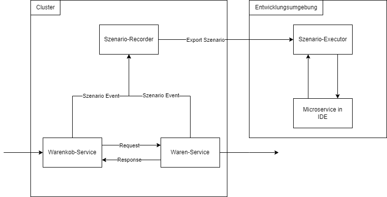

# MSA-Debugger
Dieses Repo beinhaltet ein Debugging Werkzeug für die Fehleranalyse von Microservice Architekturen, indem dieser die Kommunikation innerhalb einer Microservice Anwendung aufnimmt und diese anschließend in einer lokalen Entwicklungsumgebung wiedergeben kann. Hierbei kann der Debugger die Microservice Anwendung simulieren, sodass ein einzelner Microservice in einer IDE gestartet und analysiert werden kann.

Bei diesem Debugger handelt es sich um einen **Prototyp** aus einer Masterarbeit. 



Hierfür besteht der Debugger aus drei Komponenten:
- **Scenario-Recorder**: speichert aufgenommene Kommunikationsevents und überführt diese in ein Ausführungsszenario, mit dem die Kommunikation in einer lokalen Entwicklungsumgebung erneut eingespielt werden kann.
- **Record-Agent**: fängt als Sidecar die Requests und die Responses der Microservices ab und versendet die Kommunikationsevents an den Scenario-Recorder
- **Scenario-Executor**: Simuliert innerhalb einer lokalen Entwicklungsumgebung die Microservice Anwendung und spielt die Kommunikation der Microservice Anwendung deterministisch ein.

## Voraussetzungen
Vorraussetzung für den Betrieb des Debuggers ist eine bestehende Microservice Anwendung mit Kubernetes und Istio.
- Kubernetes (getestet mit Version 1.27)
- Istio (getestet mit Version 1.17.2)

## Setup des Scenario-Recorders

Der Scenario-Recorder wird mitsamt einer Datenbank im Kubernetes Cluster betrieben. Hierbei erhält der Scenario-Recorder die aufgenommenen Requests und Responses der Microservices durch die Record-Agenten und persistiert diese in einem Ausführungsszenario.

Die Sourcen des Scenario-Recorders und eine weiter Beschreibung ist [hier in dieser README](https://github.com/LennartProchnow/MSA-Debugger/blob/main/scenario-recorder/README.md) zu finden.

Setup des Namespaces:

```` kubectl apply -f deployment/initial-setup.yaml ````

Deployment der Datenbank des Scenario-Recorders. In diesem Prototyp wird eine MariaDB verwendet. Alternativ kann ebenfalls eine PostgreSQL verwendet werden. Diese muss jedoch entsprechend im Deployment des Scenario-Recorders konfiguriert werden.

```` kubectl apply -f deployment/mariadb.yaml ````

Deployment des Scenario-Recorders:

```` kubectl apply -f deployment/scenario-recorder.yaml ````

Deployment der Record-Agents:

```` kubectl apply -f "deployment/Envoy Config/http-envoy-filter.yaml ````

## Setup des Scenario-Executor

Der Scenario-Executor wird in einer lokalen Entwicklungsumgebung gestartet. Ein Beschreibung der Nutzug ist [hier in dieser README](https://github.com/LennartProchnow/MSA-Debugger/blob/main/msa-debugger-replayer/README.md) zu finden.